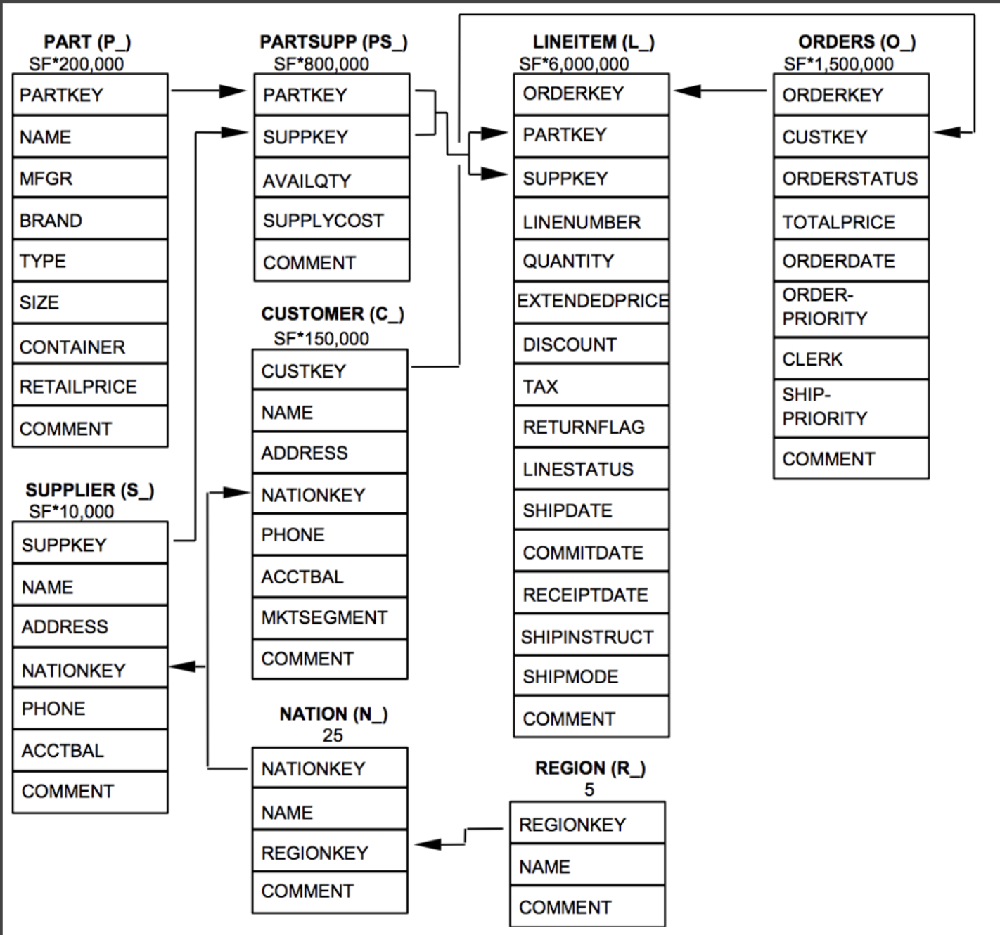
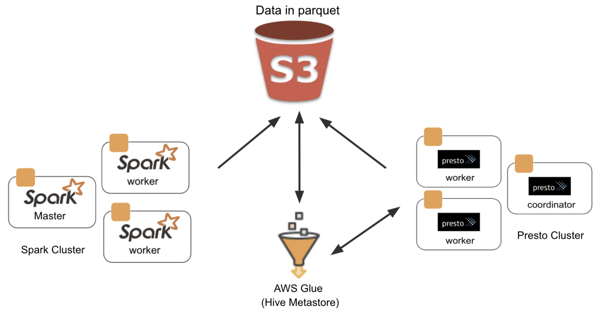

# perf-ops

`AWS` `S3` `Glue` `Presto` `Spark` `SparkSQL` `Alluxio` `Parquet` `TPC-H`

## Performance/Cost Optimizations and Benchmarks for Distributed SQL Engines

A comparative analysis of Distibuted SQL Engines `SparkSQL` and `Presto` , with and without `Alluxio`.

## Dataset and Spark ETL

- Dataset: [TPC-H](http://www.tpc.org/tpch/)

    

    
TPC-H Schema

  

    

  

* ETL Stats
  

  **7 node:** 1 x m4.xlarge(master), 6 x m4.large(worker nodes)

  **3 node:** 1 x m4.xlarge(master), 2 x m4.large(worker nodes)

## Architecture

- **Presto, Spark, Glue, S3**

  

## Results

## Queries

- q1
- q2

## Future Roadmap

- add the points from the slides

## Installations

  
Presto

  
  ## Heading
  1. A numbered
  2. list
     * With some
     * Sub bullets

  
Spark

  
  ## Heading
  1. A numbered
  2. list
     * With some
     * Sub bullets

  
Glue

  
  ## Heading
  1. A numbered
  2. list
     * With some
     * Sub bullets

  
Alluxio

  
  ## Heading
  1. A numbered
  2. list
     * With some
     * Sub bullets

## Additional Resources

- link to Slides (perf-ops)
- parquet
- presto paper link
- tpch
