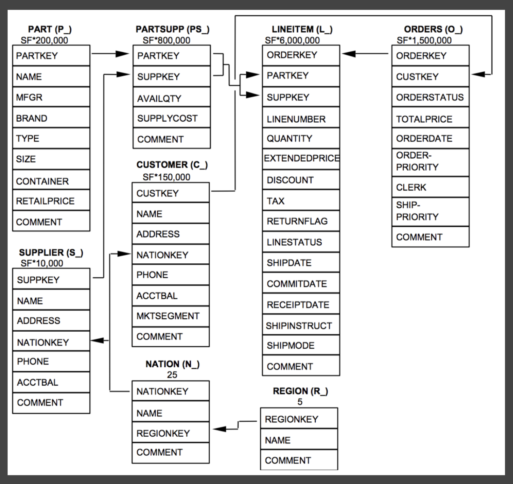
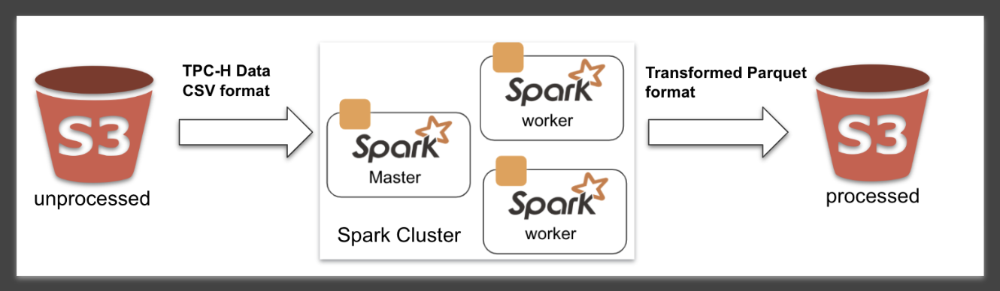
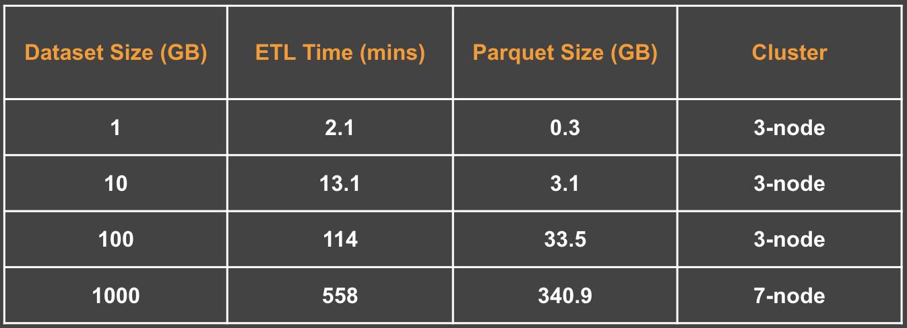
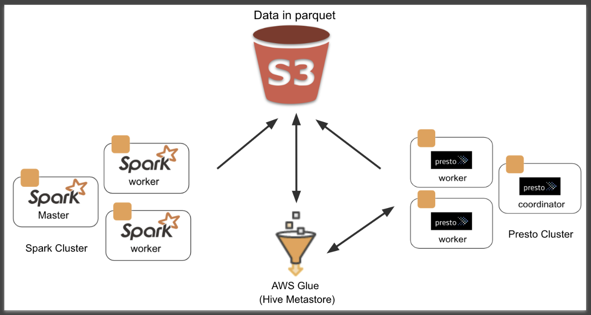
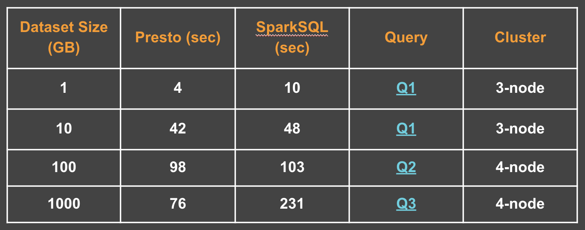
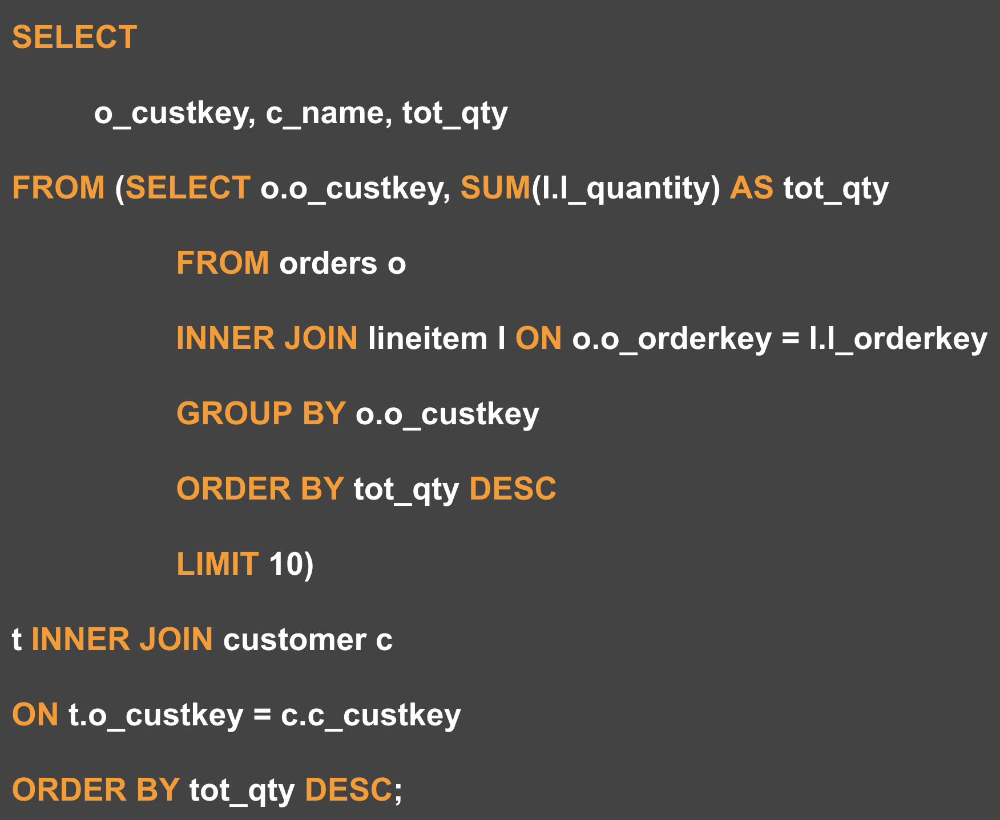
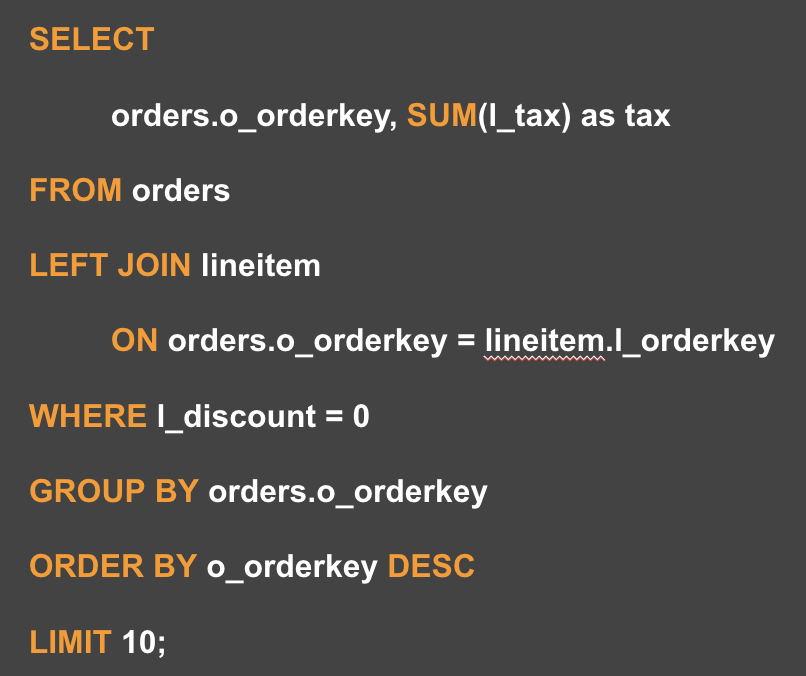

# perf-ops

`AWS` `S3` `Glue` `Presto` `Spark` `SparkSQL` `Alluxio` `Parquet` `TPC-H`

## Performance Optimizations Analysis for Distributed SQL Engines

A comparative analysis of Distibuted SQL Engines `SparkSQL` and `Presto`

## Dataset and Spark ETL

- Dataset: [TPC-H](http://www.tpc.org/tpch/)

    

    
TPC-H Schema

  

  [source](https://docs.snowflake.net/manuals/user-guide/sample-data-tpch.html)

    

  

  

  
ETL Stats

  

  **7 node:** 1 x m4.xlarge(master), 6 x m4.large(worker nodes)

  **3 node:** 1 x m4.xlarge(master), 2 x m4.large(worker nodes)

  

## Architecture

- **Presto, Spark, Glue, S3**

  

## Results

- **Query Stats**

  

- **Queries**

  

  
Q1

  

  

  

  
Q2

  

  

  

  
Q3

  

  

## Future Roadmap

- Automate the cluster provisioning

- Automate experiments and stats collection

  - Config driven framework

- Run federated queries

## Additional Resources

- [Slides](http://bit.ly/perf-ops-slides)
- [Presto paper](https://prestosql.io/Presto_SQL_on_Everything.pdf)
